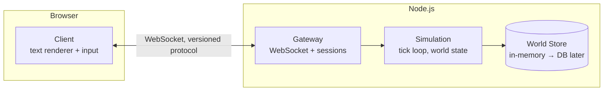

# Architecture

A browser-based, multiplayer roguelike where the entire UI is text. Any number of
players share a persistent world. Written in TypeScript, linted with ESLint, and
designed so that all game rules are testable without a browser or a network.

---

## 1. Goals & Non-Goals

### Goals

- **Text is the UI.** The world is rendered as a grid of glyphs (`@`, `#`, `g`, `~`)
  with a message log and status panels — classic roguelike presentation in the browser.
- **Massively multiplayer.** One shared world; the architecture must scale from
  2 players on a laptop to thousands across processes/machines.
- **Server-authoritative.** The server owns the truth; clients are terminals.
- **Testable by construction.** All game rules are pure functions in a dependency-free
  package, testable with plain unit tests — no DOM, no sockets.
- **Strict tooling.** TypeScript `strict`, ESLint (flat config) + Prettier, Vitest.

### Non-Goals (for v1)

- Graphics/tiles, sound, mobile-specific UI.
- Client-side prediction (server authority + interpolation is enough at first).
- Persistent accounts/database (in-memory first, storage added behind an interface).

---

## 2. High-Level Architecture



**Three npm workspaces, one source of truth:**

| Package | Runs in | Responsibility |
|---|---|---|
| `@game/shared` | both | Protocol messages, game rules (pure), types, seeded RNG, map gen |
| `@game/client` | browser | Rendering, input, networking, zero game rules |
| `@game/server` | node | WebSocket gateway, authoritative simulation, persistence |

The critical rule: **`shared` contains every game rule; `client` and `server` contain
none.** The same `shared` code runs the real game on the server and powers unit tests.

---

## 3. Tech Stack

| Concern | Choice | Why |
|---|---|---|
| Language | TypeScript 5, `strict: true` | Shared types across the wire |
| Monorepo | pnpm workspaces | Lightweight, fast, first-class workspaces |
| Client bundler | Vite | Fast dev server, trivial TS support |
| Text rendering | DOM grid first (Canvas later) | Accessible, easy to debug, fast enough for a text grid |
| Roguelike toolkit | none / hand-rolled on `shared` | Keeps rules pure and dependency-free |
| Server runtime | Node.js 20+, `tsx` for dev | Same language as client |
| WebSocket | `ws` | Minimal, battle-tested |
| Validation | `zod` (protocol boundary only) | Validate untrusted client input once, at the edge |
| Tests | Vitest (+ fast-check for property tests) | One runner for all workspaces |
| E2E smoke tests | Playwright | Real browser against a real server |
| Linting | ESLint 9 flat config + `typescript-eslint` | One config at repo root |
| Formatting | Prettier (`eslint-config-prettier` to disable conflicts) | Zero-bikeshed formatting |
| Git hooks | `lint-staged` + `simple-git-hooks` | Fast pre-commit lint/typecheck |

---

## 4. Repository Layout

```
game-mmo-text-opencode-go/
├── ARCHITECTURE.md
├── package.json                  # workspace root: scripts only
├── pnpm-workspace.yaml
├── tsconfig.base.json            # strict TS, shared by all packages
├── eslint.config.js              # flat config, typescript-eslint
├── .prettierrc.json
├── packages/
│   ├── shared/                   # @game/shared — NO runtime deps, NO I/O
│   │   ├── src/
│   │   │   ├── protocol/         # message types + zod schemas + versioning
│   │   │   ├── model/            # entities, components, world types
│   │   │   ├── rules/            # pure game logic (movement, combat, FOV…)
│   │   │   ├── mapgen/           # seeded procedural generation
│   │   │   ├── rng/              # deterministic seeded RNG
│   │   │   └── index.ts
│   │   └── tests/
│   ├── server/                   # @game/server
│   │   ├── src/
│   │   │   ├── gateway/          # WebSocket accept, auth, rate-limit, (de)serialize
│   │   │   ├── sim/              # tick loop, command queue, snapshot builder
│   │   │   ├── world/            # world store, zone management
│   │   │   ├── persistence/      # save/load behind an interface
│   │   │   └── index.ts
│   │   └── tests/                # integration tests: sim + fake clients, no sockets
│   ├── client/                   # @game/client
│   │   ├── index.html
│   │   ├── src/
│   │   │   ├── render/           # glyph grid, colors, message log, status panel
│   │   │   ├── input/            # keyboard → commands (vi-keys + arrows)
│   │   │   ├── net/              # WebSocket client, reconnect, interpolation buffer
│   │   │   ├── ui/               # screens: connect, death, help
│   │   │   └── main.ts
│   │   └── tests/                # renderer/input tests with jsdom
│   └── e2e/                      # Playwright: browser ↔ real server
└── .github/workflows/ci.yml      # lint → typecheck → test on every PR
```

Dependency direction is strictly one-way:

```
client ──┐
         ├──> shared   (server and client may import shared; shared imports nothing)
server ──┘
```

Enforce it with ESLint `import/no-restricted-paths` so nobody couples the layers
by accident.

---

## 5. Game Model

### 5.1 World & time

- The world is a set of **zones** (maps). A zone is a 2D grid of tiles plus the
  entities on it. Zones are the unit of scaling (§8).
- **Tick-based simulation** at a fixed rate (e.g. 10 ticks/sec). Each tick:
  1. Drain the command queue (one queued command per entity per tick).
  2. Run systems in a fixed, deterministic order.
  3. Collect emitted **events** for clients.
- Roguelike "speed" is modelled with **energy**: acting costs energy; entities act
  when their energy crosses a threshold. This preserves classic turn-order feel
  (fast monsters act more often) inside a real-time loop.

### 5.2 Entities & components (data-oriented, not OOP)

Entities are plain data; behaviour lives in pure functions ("systems").

```ts
type EntityId = number;

interface Position { x: number; y: number; zone: ZoneId }
interface Stats    { hp: number; maxHp: number; attack: number; defense: number }
interface Energy   { current: number; speed: number }
interface Ai       { kind: 'aggressive' | 'wander' | 'flee' }

interface World {
  tick: number;
  zones: Map<ZoneId, Zone>;
  entities: Map<EntityId, Entity>;
  // components stored as sparse maps keyed by EntityId:
  positions: Map<EntityId, Position>;
  stats:     Map<EntityId, Stats>;
  energies:  Map<EntityId, Energy>;
  ais:       Map<EntityId, Ai>;
  players:   Map<EntityId, PlayerSession>; // which entities are human-controlled
}
```

This shape is deliberately boring: serializable, diffable, and trivial to construct
in a test (`makeWorld({ ... })`).

### 5.3 Rules are pure functions

Every rule has the same signature — world in, events out, no I/O, no mutation of
input, randomness only via an injected seeded RNG:

```ts
type Rule = (world: World, rng: Rng, cmd: Command) => Event[];

// examples
tryMove(world, rng, { entity, dx, dy })   // → [Moved] | [Bumped] | [Attacked]
resolveAttack(world, rng, { attacker, target })
computeFov(world, entity)                 // → Set<TileId>  (visible tiles)
```

Consequences:

- **Determinism**: same `world + rng seed + commands` ⇒ same result. Replay tests
  and regression tests become trivial.
- **Unit tests need no fixtures**: build a tiny world in 5 lines, call the rule,
  assert on returned events.
- The server is a thin imperative shell: sockets → queue → pure rules → broadcast.

### 5.4 Procedural generation

Map generation lives in `shared/mapgen`, seeded per zone. Given the same seed,
client and server generate identical terrain — the server can send a 4-byte seed
instead of a whole map. Algorithms: BSP or cellular automata for caves, plus
hand-authored vaults spliced in.

---

## 6. Networking Protocol

### 6.1 Transport

- One WebSocket per player, JSON messages first (human-debuggable).
- The protocol is versioned (`protocolVersion` in the hello message) so binary
  encoding (MessagePack) can be swapped in later without changing call sites.

### 6.2 Message types (discriminated unions in `shared/protocol`)

```ts
// client → server
type ClientMessage =
  | { t: 'hello';  name: string; protocolVersion: number }
  | { t: 'cmd';    seq: number; cmd: Command }        // move/attack/use/quaff…
  | { t: 'ping';   clientTime: number };

// server → client
type ServerMessage =
  | { t: 'welcome';  entityId: EntityId; zoneSeed: number; tick: number }
  | { t: 'snapshot'; tick: number; entities: EntityView[] }   // full, on join/zone change
  | { t: 'delta';    tick: number; changed: EntityView[]; removed: EntityId[] }
  | { t: 'events';   tick: number; events: Event[] }          // "You hit the goblin!"
  | { t: 'reject';   seq: number; reason: string }
  | { t: 'pong';     clientTime: number; serverTime: number };
```

- **All untrusted input is parsed with zod at the gateway.** Inside the sim,
  everything is already typed and valid.
- **Interest management:** clients only receive entities inside their field of view
  plus a margin. This is both a bandwidth optimization and an anti-cheat
  (no wallhack data on the wire).
- **Snapshots + deltas:** full snapshot on join and zone change; per-tick deltas
  otherwise. Events drive the client's message log.
- Client sends commands with a sequence number; server acks implicitly by applying
  them or explicitly via `reject`.

### 6.3 Client-side flow

```
keypress → input/ → Command → net/ ──WS──▶ server
server ──WS──▶ net/ → interpolation buffer (render 1–2 ticks behind)
                   → render/ (glyph grid, log, status)
```

Render loop (`requestAnimationFrame`) is decoupled from network ticks; entity
positions interpolate between the last two snapshots so 10 ticks/sec still looks
smooth.

---

## 7. Server Architecture

### 7.1 Processes and seams

v1 runs everything in **one Node process**, but the code is split at seams that
allow horizontal scaling later:

```
Gateway (I/O)  ──commands──▶  Simulation (pure-ish core)  ──▶  WorldStore (interface)
     ▲                                                             │
     └──────────── snapshots/deltas/events ◀───────────────────────┘
```

- **Gateway**: owns sockets, session lifecycle, zod validation, per-connection
  rate limits, backpressure (drop deltas, never drop events).
- **Simulation**: owns the tick loop and the world; single-threaded by design
  (one zone = one logical thread of execution — no locks anywhere).
- **WorldStore**: interface with an in-memory implementation now; Redis/Postgres
  implementation later for persistence and cross-process hand-off.

### 7.2 Tick loop

```ts
setInterval(() => {
  const cmds = commandQueue.drain();          // validated commands from gateway
  const rng = Rng.forTick(world.tick, seed);  // deterministic per tick
  const events = stepWorld(world, cmds, rng); // shared: run all systems in order
  const views = buildInterestViews(world);    // per-player visible state
  gateway.broadcast(views, events);
}, TICK_MS);
```

### 7.3 Scaling path ("any number of players")

| Stage | Capacity | Change |
|---|---|---|
| 1. Single process | ~hundreds | — |
| 2. Zone sharding | ~thousands | Each zone runs in its own worker/process; gateway routes by player zone; zone hand-off via WorldStore |
| 3. Edge gateways | ~tens of thousands | Stateless gateways behind a load balancer; sims behind them; sticky sessions per zone |

The design constraints that make this possible are already in place: zones are
independent, the sim is single-threaded per zone, and all cross-layer
communication is by message, not shared memory.

---

## 8. Client Architecture

- **Renderer**: a `<div>` grid of monospace `<span>`s (one per tile), updated by
  diffing against the previous frame. Simple, screen-reader-friendly, and fast
  enough for an 80×50 viewport. A Canvas2D renderer can replace it behind the same
  interface (`Renderer.render(view: FrameView)`) if profiling demands it.
- **Input**: keyboard-only (arrows + vi-keys + `g`et, `i`nventory, etc.). Input
  maps to `Command` objects from `shared/protocol` — the client literally cannot
  express an illegal action.
- **State**: the client keeps no game rules, only the last two snapshots + event
  log. All display logic (colors, glyph choice) is pure `view → string` functions,
  unit-tested with jsdom.

```
┌──────────────────────────────────────────────┐
│ #############        @ - you                 │
│ #...........#        HP 12/12  Depth 3       │
│ #..@....g...#  ───▶  ─────────────           │
│ #....###....#        You hit the goblin.     │
│ #############        The goblin dies!        │
└──────────────────────────────────────────────┘
   glyph grid              sidebar + message log
```

---

## 9. Testing Strategy

Test pyramid, cheapest at the bottom:

| Layer | Tool | What | Example |
|---|---|---|---|
| Unit | Vitest | pure rules in `shared` | `tryMove` into a wall returns `Bumped`, no state change |
| Property | fast-check | rule invariants | "no entity ever occupies a wall tile", "FOV is symmetric" |
| Determinism | Vitest | replay | same seed + same command log ⇒ identical world hash |
| Integration | Vitest | sim + fake in-memory clients | two players fight; loser dies, winner sees `Died` event |
| E2E smoke | Playwright | real browser ↔ real server | connect, see `@`, press arrow, `@` moves |

Guidelines:

- **No mocks of `shared`.** The real rules *are* the test fixture; build small
  worlds with test factories (`makeWorld`, `addGoblin`).
- Fake the network at the gateway seam (`InMemoryTransport`) for integration
  tests — no ports, no flakiness.
- Snapshot-test map generation per seed; a gen algorithm change must be a
  deliberate diff.
- Coverage target: ~100% on `shared/rules`, otherwise pragmatism.
- `pnpm -r test` runs everything; CI runs lint → typecheck → all tests.

---

## 10. Linting, Formatting & Type Safety

- **ESLint 9 flat config** (`eslint.config.js` at root) with
  `typescript-eslint` recommended + `eslint-plugin-import`:
  - `import/no-restricted-paths` enforces the `client/server → shared` direction
    and forbids Node/DOM APIs inside `shared`.
  - `@typescript-eslint/no-floating-promises`, `no-unchecked-indexed-access`
    style strictness via tsconfig.
- **Prettier** handles all formatting; `eslint-config-prettier` disables
  conflicting ESLint stylistic rules. One `format` script, checked in CI.
- **tsconfig**: `strict`, `noUncheckedIndexedAccess`, `exactOptionalPropertyTypes`,
  `noImplicitOverride`. `tsconfig.base.json` extended per package with the right
  `lib` (`DOM` for client, Node types for server, neither for shared).
- **Pre-commit**: `simple-git-hooks` + `lint-staged` → eslint --fix + prettier on
  staged files; `tsc --noEmit` per package in CI.

---

## 11. Developer Workflow

```bash
pnpm install          # bootstrap all workspaces
pnpm dev              # server (tsx watch) + client (vite) concurrently
pnpm test             # vitest across workspaces
pnpm test:watch
pnpm lint / pnpm format
pnpm build            # type-check + bundle all packages
```

Client dev server proxies `/ws` to the local server, so `pnpm dev` is the only
command needed to play locally. Multiplayer testing = open two browser tabs.

---

## 12. Deployment (v1)

- Server: single Node process on any VM/container host (`node packages/server/dist`),
  env vars for port and tick rate.
- Client: static build (`vite build`) served by the same process or any CDN.
- No database yet; world resets on restart. Persistence arrives via the
  `WorldStore` interface without touching game code.

---

## 13. Phased Roadmap

1. **Walking skeleton** — connect, spawn as `@`, move on one static map, see
   another player move. Proves protocol, tick loop, renderer, CI.
2. **Roguelike core** — procgen zones, FOV, monsters with AI, melee combat,
   death/respawn, message log. All rules in `shared`, fully unit-tested.
3. **Depth** — items, inventory, stairs between zones, energy/speed tuning.
4. **Scale-out** — persistence behind `WorldStore`, zone sharding, second gateway.
5. **Polish** — interpolation smoothing, reconnect, spectator mode, binary
   protocol if bandwidth demands it.

Each phase ends playable. The walking skeleton is deliberately tiny — everything
else is additive on top of seams that already exist.
